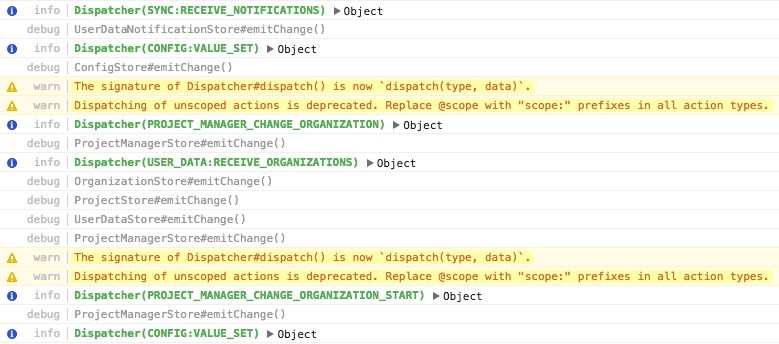

# Console Plus

[](https://travis-ci.org/jankuca/console-plus)

- Adds more `console` log levels: `fatal`, `error`, `warn`, `info`, `log`, `debug`, `trace`, `silly`.
- Makes the console output pretty, styled and prefixed by the log level:

    

- Allows log level limit (option: `logLevel`).

   ```javascript
   // Only display log levels `warn` and more severe (`error`, `fatal`).
   cplus.install({
     logLevel: cplus.LogLevels.WARN
   })
   ```

- Certain log levels can optionally be left untouched (option: `untouchedLogLevels`).

   ```javascript
   // Do not touch console.error() to keep clickable stack traces.
   cplus.install({
     untouchedLogLevels: [ cplus.LogLevels.ERROR ]
   })
   ```

## Usage

```javascript
import cplus from 'cplus'

// Plain/default installation:
cplus.install()

// Custom installation:
cplus.install({ /* options */ })
```


## Licence

MIT
